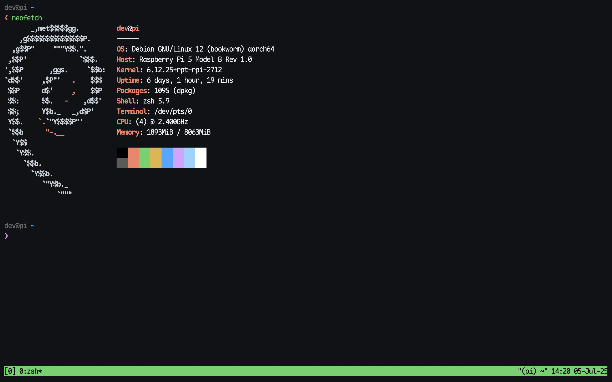
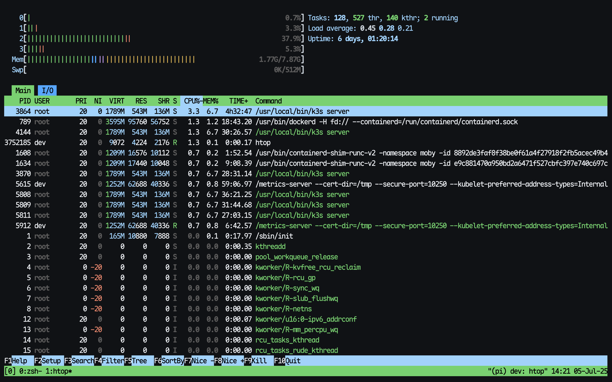
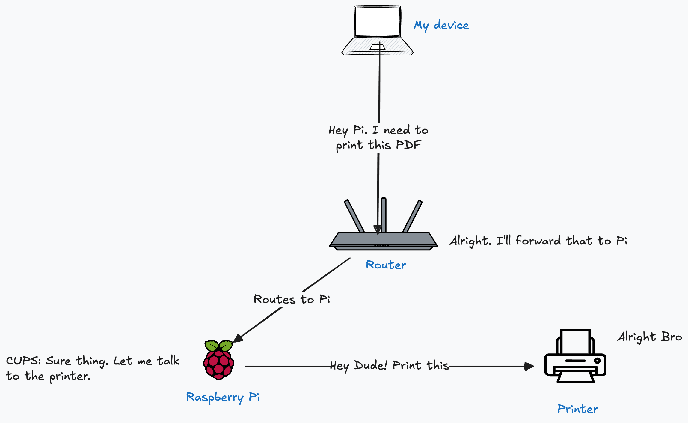
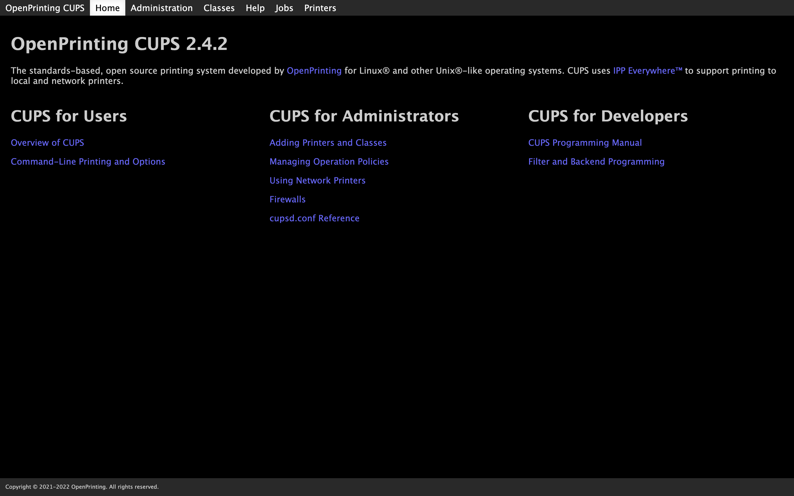
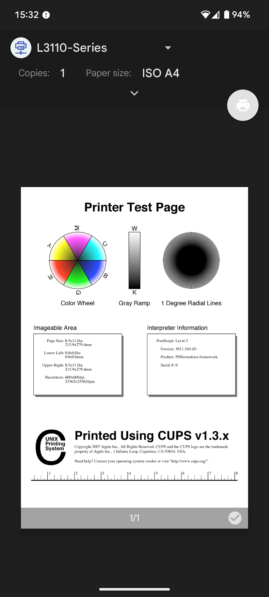

## Table of contents

## Introduction

Around the end of 2024, my free-tier cloud VMs were nearing their expiration, and I needed something
to run a few self-hosted services. After doing the math, it made more sense to get a
[Raspberry Pi](https://www.raspberrypi.com/products/) instead of continuing to pay for cloud
compute. I was already familiar with
[Cloudflare Tunnels](https://developers.cloudflare.com/cloudflare-one/connections/connect-apps/) and
[Tailscale](https://tailscale.com/), so static IPs weren’t a concern (more on the homelab setup in
another post).

I bought a [Raspberry Pi 5 Model B (8GB RAM)](https://www.raspberrypi.com/products/raspberry-pi-5/),
a 256GB SD card with good write endurance, a case, and the power supply. Flashed
[Debian Bookworm Server](https://www.debian.org/releases/bookworm/) onto it, installed
[Docker](https://www.docker.com/) and some essentials, and started hosting a few of my services.
Even with containers and a couple of headless browsers humming along, the Pi just chilled.

_See, how the Pi is barely sweating:_



## The printer problem

I had an
[Epson L3110](https://www.epson.co.in/Support/Printers/All-In-One/L-Series/Epson-L3110/s/SPT_C11CG87504)
inktank printer at home for years. It’s reliable, prints well — but it’s strictly USB. No Wi-Fi. No
network capability.

Every time someone needed to print, the drill looked like a mini side quest:

- Transfer the file to a laptop or phone with a USB-C port
- Boot up the device
- Plug in the printer
- Move the file over
- Hit print
- Wait for the job to finish
- Unplug the printer

All in, it’s a solid 5-minute ritual—every single time. Printing shouldn’t feel like compiling code
with 100+ dependencies.

One thing I tried was using the USB port on my router. It looked promising—right up until I ran into
vendor lock-in. Flashing custom firmware was more trouble than it was worth. I always had a feeling
the Pi could handle it, just never got around to setting it up.

## Finally deciding to fix it

That Sunday came. I’d been using Linux long enough to know about [CUPS](https://www.cups.org/) — the
Common UNIX Printing System. It’s a modular printing system developed by Apple that allows a
computer to act as a print server. It uses the Internet Printing Protocol (IPP) and supports
drivers, filters, and backends for converting print jobs and interfacing with physical printers.

It can make a USB printer available over the network, support job queueing, handle authentication,
and even expose web-based management at `localhost:631`. It’s what Linux uses behind the scenes when
you hit “Print.”

My plan: connect the USB printer to the Pi, install and configure CUPS, make the printer
network-accessible — and ideally never deal with file transfers for printing again.

_This is a dead simple diagram of the setup:_


## Enough Talk, How to do it?

### 1. Plug the printer into the Pi

Connect the printer via USB and make sure it shows up:

```bash
lsusb
```

You should see something like `Epson` or `Canon` listed. If it’s detected, you’re good.

### 2. Install CUPS

```bash
sudo apt update
sudo apt install cups
```

Enable and start the service:

```bash
sudo systemctl enable cups
sudo systemctl start cups
```

### 3. Add your user to the `lpadmin` group

CUPS restricts admin access to users in the `lpadmin` group:

```bash
sudo usermod -aG lpadmin $USER
newgrp lpadmin
```

### 4. Test: Print from the terminal (important!)

Before messing with config files and web UIs, try printing a test page directly:

```bash
lpstat -p -d   # See if printer is recognized
```

If it’s listed, try:

```bash
echo "Test page from Pi" | lp
```

This sends a simple print job. If it prints — great. CUPS is working.

If not, check with:

```bash
lpq
```

or:

```bash
journalctl -u cups -n 50
```

### 5. Configure CUPS to allow network access

By default, CUPS binds to localhost. Let’s open it up.

```bash
sudo vim /etc/cups/cupsd.conf
```

#### 5.1 Listen on all interfaces

```bash
Listen 0.0.0.0:631
# Listen [::]:631  # Optional IPv6
```

#### 5.2 Allow access from LAN

```bash
<Location />
  Order allow,deny
  Allow @local
</Location>

<Location /admin>
  Order allow,deny
  Allow @local
</Location>
```

### 6. Restart CUPS

```bash
sudo systemctl restart cups
```

You should now be able to visit:

```
http://<your-pi-ip>:631
```

_You should see the CUPS web UI like this:_



### 7. Add the printer via web interface

1. Go to **Administration** → **Add Printer**
2. Log in with your Pi user creds
3. Select your printer
4. Name it
5. Select a driver (if your printer is not listed, you may have to install the drivers — Don't
   worry. Just google it and you will find the right packages)
6. Finish and verify it shows under **Printers**

### 8. Enable printer sharing

From CUPS UI:

- Go to **Printers**
- Click the printer
- Admin → **Set As Shared**

Or via CLI:

```bash
lpoptions -p <printer-name> -o printer-is-shared=true
```

## 9. Final Touchups: Avahi (ZeroConf / Bonjour)

To avoid remembering IP addresses, use [Avahi](https://wiki.archlinux.org/title/Avahi) to broadcast
the Pi on your LAN using mDNS.

### 9.1 Install Avahi

```bash
sudo apt install avahi-daemon
sudo systemctl enable avahi-daemon
sudo systemctl start avahi-daemon
```

Now your Pi (and printer) should be reachable at:

```
http://raspberrypi.local:631
```

> Replace `raspberrypi` with your Pi’s hostname if changed.

## Some Caveats That You Should Know

- Android support is inconsistent. Some devices detect mDNS printers, some don’t. Blame Android.

- If it fails, install the [**NetPrinter app**](https://netprinter.app/) — it works because:
  - It supports IPP natively (what CUPS exposes)
  - Lets you manually enter the printer URL:
    ```
    http://raspberrypi.local:631/
    ```
  - Bypasses Android’s flaky discovery stack entirely

Steps:

1. Install NetPrinter
2. Tap + to add printer
3. Enter raspberry pi cups service URL
4. Save and print

## Final Thoughts

After one hour of hacking. This is what I got:



No more cable swapping, no more file transfers, no more printer amnesia. Just a printer that shows
up on the network like it should’ve from day one.

Also — a fun bit of trivia — the origins of the
[Free Software Movement](https://en.wikipedia.org/wiki/Free_software_movement) actually trace back
to a
[printer driver problem at MIT](https://en.wikipedia.org/wiki/Richard_Stallman#Events_leading_to_GNU).
Richard Stallman got annoyed that he couldn’t fix the bugs in a Xerox printer because the driver was
proprietary. He decided that software should be free to study, modify, and redistribute — and thus,
a movement was born.

In a weirdly poetic way, fixing a printing problem with free software on a $60 single-board computer
feels like it closes that circle.

In the end, it’s not just about printing. It’s about control. It’s about choosing tools that don’t
fight you. It’s about that quiet satisfaction when something works because you made it work.

Happy hacking, hackers. Keep the spirit alive.
